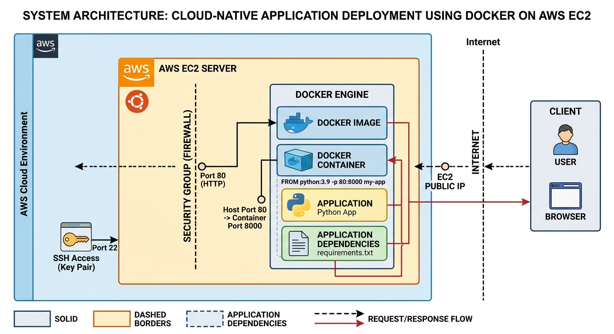

Cloud-Native Application Deployment using Docker on AWS EC2This repository contains the documentation and implementation details for deploying a containerized Python application on a cloud-native environment using Docker and AWS EC2 (Ubuntu Linux). The project focuses on bridging the gap between development and production environments through containerization.🏗️ System ArchitectureThe architecture follows a request/response flow where a client accesses the application hosted within a Docker container on an AWS EC2 instance. Security is maintained via SSH key pairs and AWS Security Groups acting as firewalls.
📖 Table of ContentsAbstractIntroductionProblem StatementObjectives & ScopeTechnology StackCore ConceptsMethodologyStep-by-Step ImplementationSecurity and NetworkingTesting and ValidationComparative AnalysisResults & ObservationsChallenges & LimitationsFuture EnhancementsConclusion📝 AbstractThe primary objective of this project is to eliminate inconsistencies between development and production environments. By using Docker, the application is packaged with all its required dependencies, ensuring portability and consistent performance when deployed on a remote AWS EC2 cloud server.🚀 IntroductionIn modern software development, deployment is as critical as the code itself. Many applications fail not because of bugs, but due to improper environment configurations. This project utilizes DevOps principles—specifically containerization and cloud computing—to create a robust deployment pipeline that is automated, reliable, and efficient.❗ Problem StatementTraditional deployment methods often suffer from:Environment Mismatch: The "it works on my machine" problem where applications behave differently across different OS or hardware.Complexity: Manual dependency management is error-prone, slow, and difficult to document.Scalability: Traditional manual setups are difficult to scale or replicate across multiple servers.🎯 Objectives & ScopePrimary Goal: Successfully deploy a Python application in a Docker container on AWS.Consistency: Ensure the environment remains the same from the developer's laptop to the AWS cloud.Automation: Use Dockerfiles to automate the environment setup.Security: Implement cloud security best practices using AWS Security Groups and SSH.🛠️ Technology StackCloud Provider: AWS (Elastic Compute Cloud - EC2)Operating System: Ubuntu Linux (Server Edition)Containerization: Docker EngineBase Image: Python 3.9-slimNetworking: SSH (Port 22), HTTP (Port 80)Tools: Terminal/CLI, Docker Desktop (for local testing)💡 Core Concepts1. Cloud Computing (AWS EC2)AWS EC2 provides scalable computing capacity. It allows users to launch virtual servers, manage storage, and configure networking and security.AMI (Amazon Machine Image): A template that contains the software configuration (OS, application server).Security Groups: Act as a virtual firewall for the instance to control inbound and outbound traffic.2. Docker & ContainerizationDocker is a platform for developing, shipping, and running applications.Docker Image: A read-only template with instructions for creating a Docker container.Docker Container: A runnable instance of an image. Unlike Virtual Machines, containers share the host's OS kernel, making them extremely lightweight.3. Ubuntu Linux FundamentalsUbuntu is a popular open-source Linux distribution. This project utilizes its robust CLI to manage the Docker engine and network configurations.📋 MethodologyThe project follows a systematic 5-phase approach:Planning: Defining the application requirements and dependency list.Infrastructure: Provisioning the AWS EC2 instance and configuring the network.Environment Setup: Installing Docker and essential tools on the remote server.Containerization: Writing the Dockerfile and building the application image.Deployment: Running the container and validating the live application.🚀 Step-by-Step ImplementationPhase 1: Infrastructure SetupLaunch EC2: Select an Ubuntu 22.04 LTS AMI. Choose a t2.micro instance (Free Tier eligible).Security Group: Add a rule to allow HTTP (Port 80) from anywhere and SSH (Port 22) from your IP.Key Pair: Download the .pem file.Phase 2: Environment ConfigurationAccess the Server:ssh -i "your-key.pem" ubuntu@your-ec2-public-dns

Update & Install Docker:sudo apt update && sudo apt upgrade -y
sudo apt install docker.io -y
sudo systemctl start docker
sudo systemctl enable docker

Phase 3: Containerization & DeploymentCreate Dockerfile:# Use official Python runtime as a parent image
FROM python:3.9-slim

# Set the working directory
WORKDIR /app

# Copy current directory contents into the container
COPY . /app

# Install needed packages
RUN pip install --no-cache-dir -r requirements.txt

# Make port 8000 available to the world outside this container
EXPOSE 8000

# Run the application
CMD ["python", "app.py"]

Build and Run:# Build the image
sudo docker build -t my-python-app .

# Run the container (Map Host 80 to Container 8000)
sudo docker run -d -p 80:8000 --name web-server my-python-app

🔒 Security and NetworkingFirewall (Security Groups): Port 80 is opened specifically for public web traffic, while all other ports remain closed.Key-Based Auth: Password login is disabled; only users with the private .pem key can access the server.Isolation: If the application is compromised, the attacker is trapped inside the container, protecting the host OS.✅ Testing and ValidationStatus Check: Run sudo docker ps to ensure the container is "Up".Browser Test: Enter the EC2 Public IP in your browser.Log Monitoring: Use sudo docker logs web-server to debug any internal errors.📊 Comparative AnalysisFeatureTraditional System (VM)Docker ContainerSetupManual, slow, and inconsistentAutomated via DockerfilePortabilityLow (Tied to Guest OS)High (Run anywhere)WeightHeavy (GBs)Lightweight (MBs)Startup TimeMinutesSecondsResource UsageHigh (High overhead)Efficient (Shared Kernel)📈 Results & ObservationsSuccess: Application successfully deployed and reachable via public internet.Reliability: The environment remained consistent from the local laptop to the AWS Cloud.Efficiency: Deployment time reduced from 30+ minutes (manual) to under 5 minutes (automated).⚠️ Challenges & LimitationsChallenges: Docker permission issues and configuring AWS inbound rules were initial hurdles.Limitations: This is a single-node deployment; it lacks auto-scaling and high availability features.🔮 Future EnhancementsCI/CD Integration: Automatically deploy changes using GitHub Actions.Orchestration: Transition to Kubernetes (EKS) for managing multiple containers.Monitoring: Implement Prometheus and Grafana for real-time health tracking.🤝 ConclusionThis project demonstrates a robust method for deploying cloud-native applications. By combining the scalability of AWS with the portability of Docker, we ensure a reliable deployment process that aligns with modern DevOps practices.Interview Summary: "I deployed a containerized application on AWS EC2 using Docker, ensuring consistent environments and scalable deployment aligned with DevOps practices."